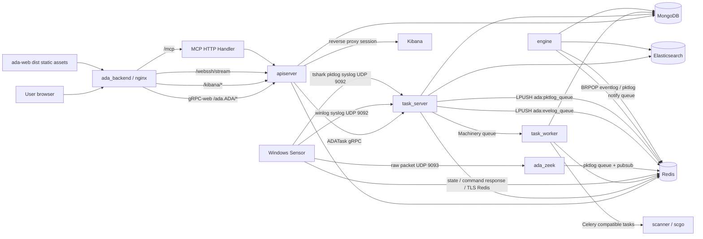

# System Architecture Overview

The `ada` repository contains the ADAegis backend runtime and the collection and detection core. It includes server-side processes, Windows Sensor, Zeek plugins, the active scanner, and shared infrastructure packages.

## Architecture Diagram

## Component Responsibilities

| Component | Code path | Runtime form | Core responsibility |
| --- | --- | --- | --- |
| apiserver | `backend/apiserver` | Process inside the `ada_backend` container | External gRPC API, authentication and authorization, business reads and writes, MCP, Kibana/WebSSH/license HTTP helper endpoints |
| task_server | `backend/tasker/cmd/server` | Process inside the `ada_backend` container | Internal gRPC task entrypoint, cron scheduling, syslog receiving, pktlog pubsub consumption, ES status monitoring |
| task_worker | `backend/tasker/cmd/worker` | Process inside the `ada_backend` container | Executes Machinery async tasks, including domain sync, LDAP asset sync, rule sync, scan orchestration, notifications, and report export |
| engine | `engine` | `ada_engine` container | Consumes log queues, runs Sigma rule matching and Flow correlation, and produces activity/event alerts |
| scanner | `scanner` | `ada_scanner` container | Consumes Celery-compatible scan tasks and invokes Python `.so` plugins for baseline, leak, and weak-password checks |
| sensor | `agent/sensor` | Windows service `adaegis` | Registers with the server, receives commands, collects event logs and network traffic, runs plugins, reports status, and self-upgrades |
| zeek | `zeek/plugins` | `ada_zeek` container | Receives raw packets forwarded by sensors, parses AD-related protocols, and writes to the Redis pktlog queue |
| infra | `infra` | Shared Go packages | MongoDB, Redis, log hooks, encryption, license, self-update, gocelery, and other shared capabilities |

## Control Plane and Data Plane

The control plane mainly handles configuration, commands, tasks, and status:

- Users call apiserver through the frontend or MCP.
- apiserver writes MongoDB and Redis, and calls task_server when needed.
- Sensors use Redis TLS to fetch commands and report status.
- engine receives rule reload signals through the `ada:engine:reload` pubsub channel.

The data plane mainly handles logs, traffic, and detection results:

- Windows event logs enter task_server through the sensor syslog output.
- The legacy packet plugin sends raw packets to Zeek on `9093/udp`.
- The tshark plugin can generate pktlog JSON directly and send it to task_server through `9092/udp` syslog.
- task_server writes logs to Redis queues and Elasticsearch.
- engine consumes `ada:evelog_queue` and `ada:pktlog_queue`, then produces activity and event alerts.

## Key Boundaries

| Boundary | Description |
| --- | --- |
| Frontend and backend | The `../ada-web` `dist` build is copied to `script/docker/backend/static`, then served by nginx from `/home/adadmin/static` inside the image |
| External API and internal tasks | External users call only apiserver; long-running work is forwarded by apiserver to task_server/task_worker |
| Log landing and detection | task_server receives, counts, and stores logs; engine performs rule matching and alert generation |
| Active scan orchestration and plugin execution | task_worker splits scan tasks; scanner/scgo consumes tasks and runs plugins |
| Sensor control and log transport | Control and status use Redis TLS; logs and traffic use UDP |

## Code Reading Path

1. Start with `script/docker/docker-compose.yml` to understand the service topology.
2. Read `script/docker/backend/conf/supervisord.conf` to understand the multiple processes inside the backend container.
3. Read `backend/apiserver/api/v2/ada.proto` to understand the external RPC surface.
4. Read `backend/tasker/server/server.go` to understand the convergence point for tasks, cron, syslog, and pubsub.
5. Read `engine/core/core.go` and `engine/core/match.go` to understand the detection engine.
6. Read `agent/sensor/plugin` to understand Windows collection plugins.
7. Read `scanner/scgo/service.go` to understand the active scan worker.
