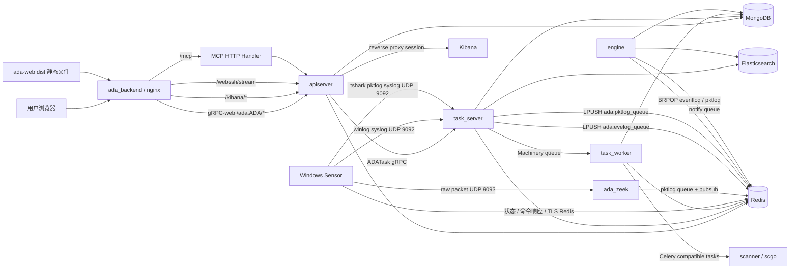

# 系统架构总览

`ada` 仓库承载 ADAegis 的后端运行时和采集检测核心。它既包含服务端进程，也包含 Windows Sensor、Zeek 插件、主动扫描器和共享基础设施代码。

## 架构图

## 组件职责

| 组件 | 代码位置 | 运行形态 | 核心职责 |
| --- | --- | --- | --- |
| apiserver | `backend/apiserver` | `ada_backend` 容器内进程 | 对外 gRPC API、认证鉴权、业务查询和写入、MCP、Kibana/WebSSH/License HTTP 辅助端点 |
| task_server | `backend/tasker/cmd/server` | `ada_backend` 容器内进程 | 内部 gRPC 任务入口、cron 调度、syslog 接收、pktlog pubsub 消费、ES 状态监控 |
| task_worker | `backend/tasker/cmd/worker` | `ada_backend` 容器内进程 | 执行 Machinery 异步任务，包括域同步、LDAP 资产同步、规则同步、扫描编排、通知、报表导出 |
| engine | `engine` | `ada_engine` 容器 | 消费日志队列，执行 Sigma 规则匹配和 Flow 关联，产生 activity/event 告警 |
| scanner | `scanner` | `ada_scanner` 容器 | 消费 Celery 兼容扫描任务，调用 Python `.so` 插件执行 baseline、leak、weakpwd 检测 |
| sensor | `agent/sensor` | Windows 服务 `adaegis` | 注册到服务端、接收命令、采集事件日志和网络流量、运行插件、上报状态、自升级 |
| zeek | `zeek/plugins` | `ada_zeek` 容器 | 接收 sensor 转发的原始数据包，解析 AD 相关协议，写入 Redis pktlog 队列 |
| infra | `infra` | 共享 Go 包 | Mongo、Redis、日志 hook、加密、license、selfupdate、gocelery 等基础能力 |

## 控制面和数据面

控制面主要处理配置、命令、任务和状态：

- 用户通过前端或 MCP 调用 apiserver。
- apiserver 写 MongoDB 和 Redis，必要时调用 task_server。
- sensor 通过 Redis TLS 连接拉取命令和上报状态。
- engine 通过 `ada:engine:reload` pubsub 接收规则热加载信号。

数据面主要处理日志、流量和检测结果：

- Windows eventlog 通过 sensor 的 syslog 输出进入 task_server。
- 传统 packet plugin 把原始数据包发到 Zeek 的 `9093/udp`。
- tshark plugin 可直接生成 pktlog JSON，再通过 `9092/udp` syslog 进入 task_server。
- task_server 负责把日志写入 Redis 队列和 Elasticsearch。
- engine 消费 `ada:evelog_queue` 与 `ada:pktlog_queue`，产生活动和事件告警。

## 关键边界

| 边界 | 说明 |
| --- | --- |
| 前端和后端 | `../ada-web` 打包后的 `dist` 被复制到 `script/docker/backend/static`，镜像内由 nginx 从 `/home/adadmin/static` 服务 |
| 外部 API 和内部任务 | 外部用户只调用 apiserver；耗时任务由 apiserver 转发到 task_server/task_worker |
| 日志落地和检测 | task_server 只做接收、统计和存储；engine 才做规则匹配和告警生成 |
| 主动扫描编排和插件执行 | task_worker 负责拆分任务；scanner/scgo 负责消费任务和运行插件 |
| sensor 控制和日志传输 | 控制状态走 Redis TLS；日志与流量走 UDP |

## 代码阅读路线

1. 从 `script/docker/docker-compose.yml` 看服务拓扑。
2. 看 `script/docker/backend/conf/supervisord.conf` 理解 backend 容器内多进程。
3. 看 `backend/apiserver/api/v2/ada.proto` 理解对外 RPC surface。
4. 看 `backend/tasker/server/server.go` 理解任务、cron、syslog 和 pubsub 汇聚点。
5. 看 `engine/core/core.go` 和 `engine/core/match.go` 理解检测引擎。
6. 看 `agent/sensor/plugin` 理解 Windows 采集插件。
7. 看 `scanner/scgo/service.go` 理解主动扫描 worker。
