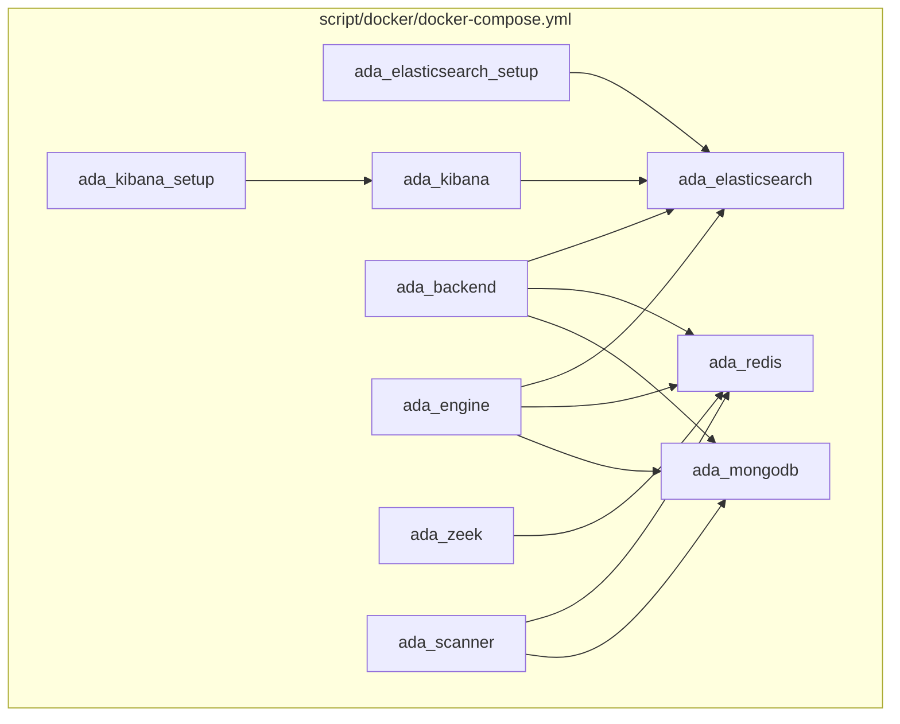
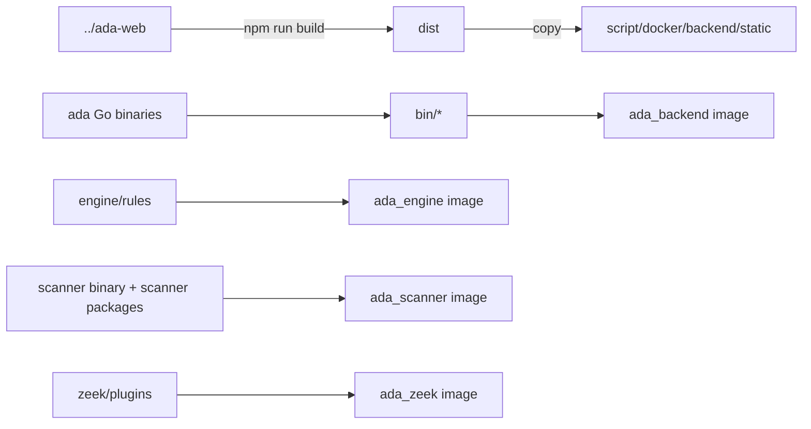

# Runtime and Deployment Topology

The main deployment mode for this project is Docker Compose. The top-level orchestration file is `script/docker/docker-compose.yml`, and the image build and release script is `script/docker/build.sh`.

## Container Topology

## Service List

| Compose service | Main ports | Volumes | Responsibility |
| --- | --- | --- | --- |
| `ada_mongodb` | `27017/tcp` | `mongodb_data` | Primary business database |
| `ada_redis` | `6379/tcp`, `9091/tcp` | `redis_data` | Queues, cache, sensor TLS control channel |
| `ada_elasticsearch` | `9200/tcp` | `es_data` | Log and alert search store |
| `ada_kibana` | `5601/tcp` | None | Kibana dashboards |
| `ada_backend` | `80/tcp`, `9092/udp` | `backend_data`, `report_data`, `rules_data` | nginx, apiserver, task_server, task_worker |
| `ada_engine` | No host port | `engine_data`, `rules_data` | Detection engine |
| `ada_zeek` | `9093/udp` | None | Traffic receiving and Zeek protocol parsing |
| `ada_scanner` | No host port | `scanner_data` | Active scan worker |

## Processes Inside the backend Container

The `ada_backend` image is built from `script/docker/backend/Dockerfile`. It uses supervisor to start four process groups:

| Process | Configuration | Description |
| --- | --- | --- |
| `nginx` | `script/docker/backend/conf/nginx.conf` | Static assets, gRPC-web entrypoint, MCP entrypoint, Kibana/WebSSH/download proxy |
| `apiserver` | `APISERVER_CONF_PATH=/home/adadmin/conf/apiserver.yaml` | gRPC listens on `127.0.0.1:8800`; helper HTTP service listens on `127.0.0.1:8801` |
| `task_server` | `TASKER_CONF_PATH=/home/adadmin/conf/tasker.yaml` | gRPC listens on `127.0.0.1:8802`; HTTP listens on `127.0.0.1:8803`; syslog listens on `0.0.0.0:9092/udp` |
| `task_worker` | `TASKER_CONF_PATH=/home/adadmin/conf/tasker.yaml` | Machinery worker with default queue `ada:tasker:task_queue` |

Externally exposed entrypoints are mainly handled by nginx:

- `/`: frontend static assets.
- `/ada.ADA/*`: gRPC-web to apiserver.
- `/mcp`: HTTP streamable MCP to apiserver.
- `/kibana/*`: Kibana proxied through apiserver.
- `/webssh/stream`: WebSSH websocket.
- `/download/*`: download sensor packages, reports, and other files.

## Build and Release Path

Core actions in `script/docker/build.sh`:

- `build_frontend`: runs `npm run build` in `../ada-web` and copies `dist` into the backend image build context.
- `build_backend`: runs `make apiserver task_server task_worker`, copies binaries, configuration, sensor packages, and static assets, then builds `ada_backend`.
- `build_engine`: runs `make engine`, copies the rules directory, then builds `ada_engine`.
- `build_scanner`: runs `make scanner` and builds `ada_scanner`.
- `build_zeek`: builds the Zeek image.
- `package`: saves selected images to tar files with `docker save`.
- `deploy`: copies the tar files to the test server and restarts the corresponding compose service.

## Configuration Entrypoints

| Module | Default environment variable | Default file name | Common image path |
| --- | --- | --- | --- |
| apiserver | `APISERVER_CONF_PATH` | `./apiserver.yaml` | `/home/adadmin/conf/apiserver.yaml` |
| tasker | `TASKER_CONF_PATH` | `./tasker.yaml` | `/home/adadmin/conf/tasker.yaml` |
| engine | `ENGINE_CONF_PATH` | `./engine.yaml` | `/home/adadmin/conf/engine.yaml` or working directory |
| scanner | `SCANNER_CONF_PATH` | `./scanner.yaml` | `/home/adadmin/conf/scanner.yaml` or working directory |
| sensor | No unified environment variable | `sensor.yaml` or `sensor.cfg` | `C:\Program Files\adaegis` |

Documentation examples do not include real passwords. Production credentials should be injected or replaced through secure release channels.

## Persistent Directories

| Volume | Container path | Purpose |
| --- | --- | --- |
| `backend_data` | `/home/adadmin/logs` | backend, tasker, and supervisor logs |
| `report_data` | `/home/adadmin/download/report` | Exported reports |
| `rules_data` | `/home/adadmin/rules` | winlog, pktlog, and flow rules |
| `engine_data` | `/home/adadmin/logs` | engine logs |
| `scanner_data` | `/home/adadmin/logs` | scanner logs |
| `mongodb_data` | `/data/db` | MongoDB data |
| `redis_data` | `/data` | Redis data |
| `es_data` | `/usr/share/elasticsearch/data` | Elasticsearch data |

## Runtime Health Checks

- backend health check calls `http://localhost:8801/ping`.
- MongoDB, Redis, Elasticsearch, and Kibana all have compose healthchecks.
- For process-level issues, first check `/home/adadmin/logs` inside the `ada_backend` container and supervisor stderr logs.
- For static asset issues, first check nginx logs at `/var/log/nginx/ada_access.log` and `/var/log/nginx/ada_error.log`.
