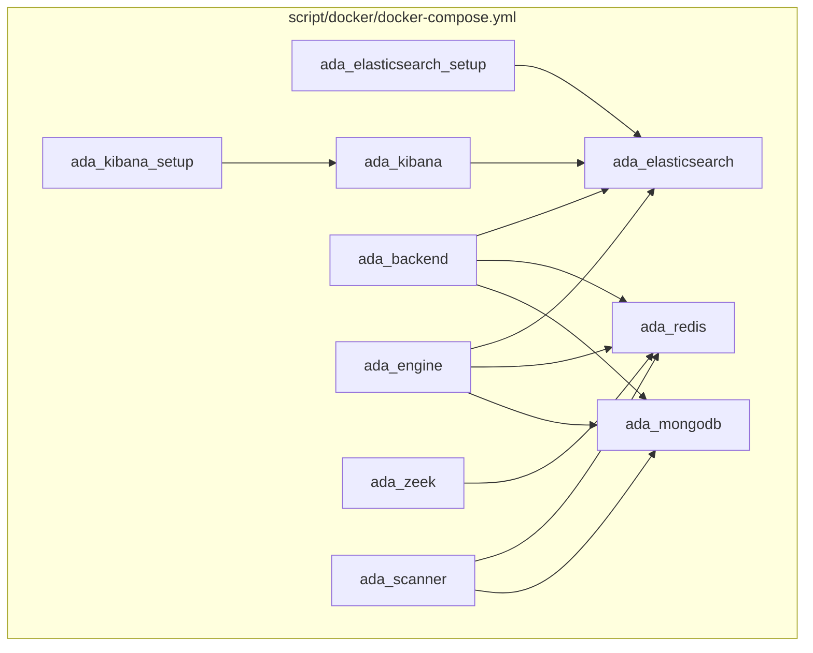
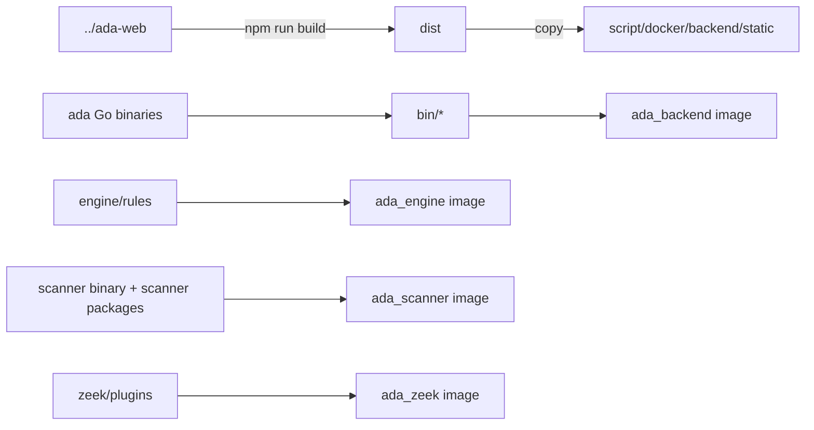

# 运行时与部署拓扑

本项目的主部署方式是 Docker Compose。顶层编排文件位于 `script/docker/docker-compose.yml`，镜像构建与发布脚本位于 `script/docker/build.sh`。

## 容器拓扑

## 服务列表

| Compose 服务 | 主要端口 | 数据卷 | 职责 |
| --- | --- | --- | --- |
| `ada_mongodb` | `27017/tcp` | `mongodb_data` | 业务主库 |
| `ada_redis` | `6379/tcp`, `9091/tcp` | `redis_data` | 队列、缓存、sensor TLS 控制通道 |
| `ada_elasticsearch` | `9200/tcp` | `es_data` | 日志和告警检索库 |
| `ada_kibana` | `5601/tcp` | 无 | Kibana 展示 |
| `ada_backend` | `80/tcp`, `9092/udp` | `backend_data`, `report_data`, `rules_data` | nginx、apiserver、task_server、task_worker |
| `ada_engine` | 无宿主端口 | `engine_data`, `rules_data` | 规则引擎 |
| `ada_zeek` | `9093/udp` | 无 | 流量接收和 Zeek 协议解析 |
| `ada_scanner` | 无宿主端口 | `scanner_data` | 主动扫描 worker |

## backend 容器内部进程

`ada_backend` 镜像由 `script/docker/backend/Dockerfile` 构建。它用 supervisor 拉起四类进程：

| 进程 | 配置 | 说明 |
| --- | --- | --- |
| `nginx` | `script/docker/backend/conf/nginx.conf` | 静态资源、gRPC-web 入口、MCP 入口、Kibana/WebSSH/download 代理 |
| `apiserver` | `APISERVER_CONF_PATH=/home/adadmin/conf/apiserver.yaml` | gRPC 监听 `127.0.0.1:8800`，HTTP 辅助服务监听 `127.0.0.1:8801` |
| `task_server` | `TASKER_CONF_PATH=/home/adadmin/conf/tasker.yaml` | gRPC 监听 `127.0.0.1:8802`，HTTP 监听 `127.0.0.1:8803`，syslog 监听 `0.0.0.0:9092/udp` |
| `task_worker` | `TASKER_CONF_PATH=/home/adadmin/conf/tasker.yaml` | Machinery worker，默认队列 `ada:tasker:task_queue` |

对外暴露入口主要由 nginx 统一承接：

- `/`：前端静态资源。
- `/ada.ADA/*`：gRPC-web 到 apiserver。
- `/mcp`：HTTP streamable MCP 到 apiserver。
- `/kibana/*`：经 apiserver 代理 Kibana。
- `/webssh/stream`：WebSSH websocket。
- `/download/*`：下载传感器包、报表等文件。

## 构建和发布路径

`script/docker/build.sh` 的核心动作：

- `build_frontend`：在 `../ada-web` 执行 `npm run build`，把 `dist` 复制到 backend 镜像构建目录。
- `build_backend`：执行 `make apiserver task_server task_worker`，复制二进制、配置、sensor 安装包和静态资源，构建 `ada_backend`。
- `build_engine`：执行 `make engine`，复制规则目录，构建 `ada_engine`。
- `build_scanner`：执行 `make scanner`，构建 `ada_scanner`。
- `build_zeek`：构建 Zeek 镜像。
- `package`：把指定镜像 `docker save` 成 tar。
- `deploy`：把 tar 复制到测试服务器并重启对应 compose 服务。

## 配置文件入口

| 模块 | 默认环境变量 | 默认文件名 | 常见镜像路径 |
| --- | --- | --- | --- |
| apiserver | `APISERVER_CONF_PATH` | `./apiserver.yaml` | `/home/adadmin/conf/apiserver.yaml` |
| tasker | `TASKER_CONF_PATH` | `./tasker.yaml` | `/home/adadmin/conf/tasker.yaml` |
| engine | `ENGINE_CONF_PATH` | `./engine.yaml` | `/home/adadmin/conf/engine.yaml` 或工作目录 |
| scanner | `SCANNER_CONF_PATH` | `./scanner.yaml` | `/home/adadmin/conf/scanner.yaml` 或工作目录 |
| sensor | 无统一环境变量 | `sensor.yaml` 或 `sensor.cfg` | `C:\Program Files\adaegis` |

文档示例不列出配置中的真实密码。发布环境应通过安全渠道注入或替换默认配置中的凭据。

## 持久化目录

| 卷 | 容器路径 | 用途 |
| --- | --- | --- |
| `backend_data` | `/home/adadmin/logs` | backend、tasker、supervisor 日志 |
| `report_data` | `/home/adadmin/download/report` | 导出报表 |
| `rules_data` | `/home/adadmin/rules` | winlog、pktlog、flow 规则 |
| `engine_data` | `/home/adadmin/logs` | engine 日志 |
| `scanner_data` | `/home/adadmin/logs` | scanner 日志 |
| `mongodb_data` | `/data/db` | MongoDB 数据 |
| `redis_data` | `/data` | Redis 数据 |
| `es_data` | `/usr/share/elasticsearch/data` | Elasticsearch 数据 |

## 运行健康检查

- backend 健康检查访问 `http://localhost:8801/ping`。
- MongoDB、Redis、Elasticsearch、Kibana 均在 compose 中有 healthcheck。
- 进程级问题优先查 `ada_backend` 容器内 `/home/adadmin/logs` 和 supervisor stderr 日志。
- 静态资源问题优先查 nginx 的 `/var/log/nginx/ada_access.log` 和 `/var/log/nginx/ada_error.log`。
