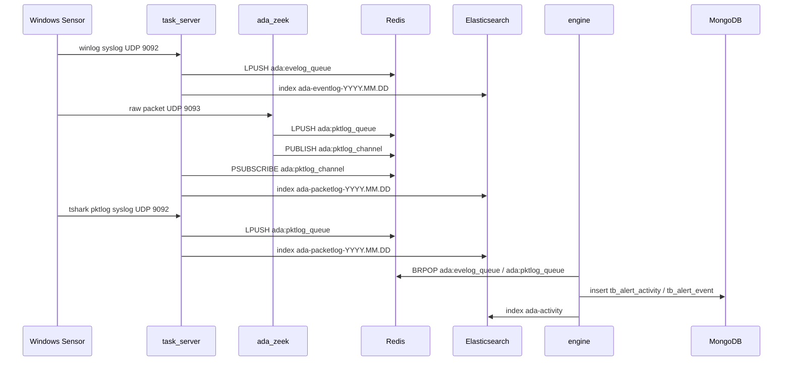

# Collection and Detection Data Flow

ADAegis has three main log collection paths: Windows eventlog, raw network packets through Zeek, and tshark-generated pktlog. All three paths eventually converge in Redis, Elasticsearch, and engine.

## Overall Data Flow

## Windows Eventlog Path

Code entrypoints:

- `agent/sensor/plugin/plugin_evt.go`
- `agent/sensor/winevt/operator/output/syslog`
- `backend/tasker/server/syslog_svc.go`

Processing flow:

1. The sensor event plugin reads Windows event logs.
2. The output side uses syslog, with fixed tag `ADASensor` and the DC FQDN as hostname.
3. task_server listens on `TaskSrv.SyslogAddr`, exposed outside the container as `9092/udp` by default.
4. `syslogSync` validates the tag, hostname, and domain information.
5. Valid eventlog content is written to the Redis queue `ada:evelog_queue`.
6. If ES is enabled, the same content is written to `ada-eventlog-YYYY.MM.DD`.
7. `collectLogStats("winlog", ...)` updates the per-minute Redis ZSET used by the dashboard.

Key constraints:

- The hostname must include a domain part, for example `DC01.example.local`; otherwise task_server cannot extract the domain.
- The domain and DC/IP relationship must already be present in the Redis cache, or task_server will ignore logs that cannot be attributed.
- Eventlog JSON uses `@timestamp` as the ES time field.

## Raw Packet Path Through Zeek

Code entrypoints:

- Sensor packet plugin: `agent/sensor/plugin/plugin_pkt.go`
- Zeek TrafficReceiver: `zeek/plugins/zeek-adaegis-receiver`
- Zeek RedisWriter: `zeek/plugins/zeek-adaegis-redis`
- task_server pktlog pubsub: `backend/tasker/server/syslog_svc.go`

Processing flow:

1. The sensor packet plugin captures packets from the configured NIC with pcap.
2. The default BPF excludes traffic related to server communication to reduce control-plane loopback noise.
3. The sensor sends raw packet data to the server `PktSrvPort`, default `9093/udp`.
4. Zeek starts with `trafficreceiver::0.0.0.0:9093` and parses AD-related protocols such as Kerberos, RDP, NTLM, LDAP, DCE/RPC, and SMB.
5. RedisWriter converts Zeek logs to JSON and inserts `Hostname`.
6. RedisWriter writes `ada:pktlog_queue` and also publishes to `ada:pktlog_channel`.
7. task_server `PktlogServe` subscribes to `ada:pktlog_channel` for ES writes and dashboard statistics.
8. engine consumes logs from `ada:pktlog_queue` and runs pktlog Sigma rules.

Why both queue and pubsub are used:

- The queue is for engine consumption and can absorb backlog.
- pubsub is for task_server to write ES and statistics in real time without affecting engine queue consumption.

## tshark pktlog Path

Code entrypoints:

- `agent/sensor/plugin/plugin_tshark.go`
- `agent/sensor/tshark`
- `backend/tasker/server/syslog_svc.go`

Processing flow:

1. The sensor starts the tshark plugin, preferring the Redis-configured `tshark_path`; otherwise it searches default locations such as `C:\Program Files\adaegis\tshark\tshark.exe`.
2. tshark outputs EK JSON or field rows.
3. The plugin normalizes fields and generates `LogType=pktlog`, `Source=tshark`, `EventType`, `Hostname`, `SensorTime`, and `@timestamp`.
4. The plugin removes obsolete fields `FrameTimeEpoch` and `FrameProtocols`.
5. The plugin sends the event to task_server through syslog UDP `9092`.
6. task_server recognizes pktlog syslog, writes `ada:pktlog_queue`, and writes ES and statistics.

This path is useful when protocol fields need to be extracted directly on Windows and the deployment should not depend on Zeek parsing raw packets in the container.

## ES Indices

| Index | Writer | Content |
| --- | --- | --- |
| `ada-eventlog-YYYY.MM.DD` | task_server | Raw Windows eventlog JSON |
| `ada-packetlog-YYYY.MM.DD` | task_server | Network protocol logs generated by Zeek/tshark |
| `ada-activity` | engine | Activity generated after Sigma single-event matches |

task_server creates eventlog/pktlog indices by date and sets the `@timestamp` mapping. packetlog additionally sets `SensorTime`, `SrcPort`, `DstPort`, and `ProtocolFields`.

## Dashboard Log Statistics

task_server maintains per-domain, per-minute Redis ZSETs:

- `ada:server:stats:winlog:<domain>`
- `ada:server:stats:pktlog:<domain>`

apiserver `DashboardLogStats` reads series data from these keys. Because statistics depend on the task_server consumption path, if dashboard values stay at 0 for a long time, check:

1. Whether task_server receives syslog or the pktlog channel.
2. Whether the domain can be extracted from hostname and found in the Redis domain cache.
3. Whether Redis ZSETs contain recent minute data.
4. Whether ES failures only affect search; do not misread ES write failure as engine queue failure.
