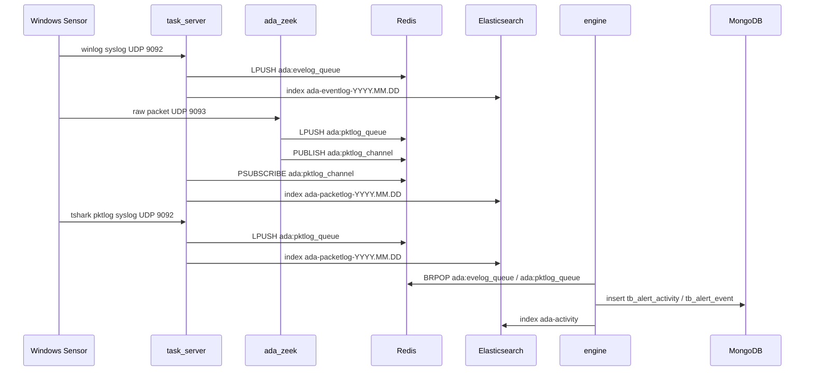

# 采集与检测数据流

ADAegis 的日志采集主要分为三条路径：Windows eventlog、原始网络包经 Zeek、tshark 直接生成 pktlog。三条路径最终都会汇聚到 Redis、Elasticsearch 和 engine。

## 总体数据流

## Windows Eventlog 路径

代码入口：

- `agent/sensor/plugin/plugin_evt.go`
- `agent/sensor/winevt/operator/output/syslog`
- `backend/tasker/server/syslog_svc.go`

处理过程：

1. sensor 的 event plugin 读取 Windows 事件日志。
2. 输出侧使用 syslog，tag 固定为 `ADASensor`，hostname 使用 DC 的 FQDN。
3. task_server 在 `TaskSrv.SyslogAddr` 监听 UDP，默认容器外暴露为 `9092/udp`。
4. `syslogSync` 校验 tag、hostname 和域信息。
5. 合法 eventlog 内容写入 Redis 队列 `ada:evelog_queue`。
6. 如果 ES 开启，同时写入 `ada-eventlog-YYYY.MM.DD`。
7. `collectLogStats("winlog", ...)` 更新 dashboard 需要的按分钟 Redis ZSET。

关键约束：

- hostname 需要包含域名部分，例如 `DC01.example.local`，否则 task_server 无法提取 domain。
- 域和 DC/IP 关系需要先进入 Redis 缓存，否则 task_server 会忽略无法归属的日志。
- eventlog JSON 使用 `@timestamp` 作为 ES 时间字段。

## 原始网络包经 Zeek 路径

代码入口：

- sensor packet plugin：`agent/sensor/plugin/plugin_pkt.go`
- Zeek TrafficReceiver：`zeek/plugins/zeek-adaegis-receiver`
- Zeek RedisWriter：`zeek/plugins/zeek-adaegis-redis`
- task_server pktlog pubsub：`backend/tasker/server/syslog_svc.go`

处理过程：

1. sensor 的 packet plugin 用 pcap 在指定网卡抓包。
2. BPF 默认排除与服务端通信相关的流量，减少自回环噪声。
3. sensor 把原始 packet data 通过 UDP 发给服务端 `PktSrvPort`，默认 `9093/udp`。
4. Zeek 以 `trafficreceiver::0.0.0.0:9093` 启动，解析 Kerberos、RDP、NTLM、LDAP、DCE/RPC、SMB 等 AD 相关协议。
5. RedisWriter 将 Zeek 日志转换为 JSON，并插入 `Hostname`。
6. RedisWriter 写 `ada:pktlog_queue`，同时发布到 `ada:pktlog_channel`。
7. task_server 的 `PktlogServe` 订阅 `ada:pktlog_channel`，用于写 ES 和更新 dashboard 统计。
8. engine 从 `ada:pktlog_queue` 消费日志，执行 pktlog Sigma 规则。

为什么同时写队列和 pubsub：

- 队列用于 engine 消费，具备积压能力。
- pubsub 用于 task_server 实时写 ES 和统计，不影响 engine 队列消费。

## tshark pktlog 路径

代码入口：

- `agent/sensor/plugin/plugin_tshark.go`
- `agent/sensor/tshark`
- `backend/tasker/server/syslog_svc.go`

处理过程：

1. sensor 启动 tshark plugin，优先使用 Redis 配置的 `tshark_path`，否则查找 `C:\Program Files\adaegis\tshark\tshark.exe` 等默认位置。
2. tshark 输出 EK JSON 或字段行。
3. plugin 归一化字段，生成 `LogType=pktlog`、`Source=tshark`、`EventType`、`Hostname`、`SensorTime`、`@timestamp`。
4. plugin 删除过时字段 `FrameTimeEpoch` 和 `FrameProtocols`。
5. plugin 通过 syslog UDP `9092` 发给 task_server。
6. task_server 识别 pktlog syslog 后写入 `ada:pktlog_queue`，并写 ES 与统计。

这条路径适合需要直接在 Windows 端提取 tshark 协议字段的场景，不依赖 Zeek 容器解析原始包。

## ES 索引

| 索引 | 写入方 | 内容 |
| --- | --- | --- |
| `ada-eventlog-YYYY.MM.DD` | task_server | Windows 事件日志原始 JSON |
| `ada-packetlog-YYYY.MM.DD` | task_server | Zeek/tshark 生成的网络协议日志 |
| `ada-activity` | engine | Sigma 单事件匹配后的 activity |

task_server 会按日期创建 eventlog/pktlog 索引，并设置 `@timestamp` 映射。packetlog 额外设置 `SensorTime`、`SrcPort`、`DstPort` 和 `ProtocolFields`。

## Dashboard 日志统计

task_server 会维护按域、按分钟的 Redis ZSET：

- `ada:server:stats:winlog:<domain>`
- `ada:server:stats:pktlog:<domain>`

apiserver 的 `DashboardLogStats` 从这些 key 读取序列数据。由于统计依赖 task_server 消费路径，如果 dashboard 长期为 0，应优先检查：

1. task_server 是否收到 syslog 或 pktlog channel。
2. domain 是否能从 hostname 提取并在 Redis 域缓存中找到。
3. Redis ZSET 是否有最近分钟的数据。
4. ES 是否只影响检索，不要把 ES 写入失败误判为 engine 队列失败。
