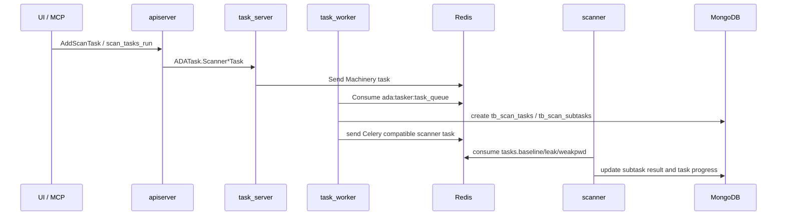

# Backend API, Authentication, and Task Scheduling

The backend is split into an external API layer and an internal task layer. apiserver serves the frontend, MCP, and external callers; task_server/task_worker handle async tasks, scheduled tasks, syslog receiving, and event processing.

## apiserver

Entrypoints:

- `backend/apiserver/cmd/apiserver.go`
- `backend/apiserver/service/service.go`
- `backend/apiserver/api/v2/ada.proto`

Startup flow:

1. Load configuration from `APISERVER_CONF_PATH` or `./apiserver.yaml`.
2. Initialize Redis, MongoDB, and log hooks.
3. Start the HTTP service for `/ping`, `/mcp`, license, WebSSH, Kibana proxy, and other endpoints.
4. Initialize `ADAServiceV2` and start the gRPC service.

## gRPC API Scope

`backend/apiserver/api/v2/ada.proto` defines the main business interfaces:

| Domain | Representative interfaces |
| --- | --- |
| Users and authentication | `Login`, `Logout`, `ListUser`, `EnableMfa`, `GenerateAccessKey` |
| Domain management | `ListDomain`, `AddDomain`, `UpdateDomainData`, `DeploySensor` |
| Sensor management | `ListSensor`, `UpdateSensor`, `CmdSensor`, `DownloadSensor`, `UpdateSensorVersion` |
| System management | `GetSystemInfo`, `GetSystemStats`, `NetworkDebug`, `GetLicense` |
| Notifications and exports | `ListNotifyConf`, `AddExportTask`, `ListAuditLog`, `ListSystemLogs` |
| Threat detection | `ListThreat`, `GetThreat`, `ActionThreat`, `ListActivity` |
| Rule management | `ListAlertRule`, `AddAlertRule`, `ListActivityRule`, `AddActivityRule` |
| Active scanning | `ScanRiskStats`, `ListBaseline`, `ListLeak`, `ListWeakPwd`, `AddScanTask` |
| Dashboard | `DashboardStats`, `DashboardTrends`, `DashboardLogStats` |

## Authentication and Authorization

apiserver chains gRPC unary interceptors:

- recovery
- handler/context injection
- logging/audit
- validator
- authentication/authorization

Authentication methods:

- After user login, requests use a JWT Bearer token.
- MCP also supports AccessKey secret hash authentication. After authentication succeeds, it reuses the same user identity and ACL logic as gRPC.

Authorization notes:

- Whitelisted interfaces include login, MFA check, logout, and license-related methods.
- Other interfaces need `authorization: Bearer <token>` from metadata.
- apiserver updates the active time for users or AccessKeys, but throttles writes to avoid updating MongoDB on every request.

## MCP

Entrypoints:

- HTTP path: `/mcp`
- nginx forwarding: `location = /mcp`
- Implementation: `backend/apiserver/service/mcp.go`

The MCP server uses the streamable HTTP handler from `modelcontextprotocol/go-sdk`. Tool calls ultimately reuse existing business methods on `ADAServiceV2`.

Current tool surface:

| Domain | Tools |
| --- | --- |
| Alerts | `alerts_list`, `alerts_get`, `alerts_dispose` |
| Correlation alert rules | `alert_rules_list`, `alert_rules_add`, `alert_rules_update`, `alert_rules_delete` |
| Sigma/activity rules | `activity_rules_list`, `activity_rules_add`, `activity_rules_update`, `activity_rules_delete` |
| Active scan results | `scan_baselines_list`, `scan_baselines_get`, `scan_vulnerabilities_list`, `scan_weak_passwords_list` |
| Scan tasks | `scan_tasks_list`, `scan_tasks_get`, `scan_tasks_run`, `scan_tasks_recheck` |

Design principles:

- MCP does not bypass the business layer for direct database reads or writes.
- Every tool call performs the same permission checks as gRPC.
- Return values are converted from protobuf JSON to regular maps, making them easier for MCP clients to consume.

## task_server

Entrypoints:

- `backend/tasker/cmd/server/main.go`
- `backend/tasker/server/server.go`
- `backend/tasker/api/ada_task.proto`

After startup, it runs:

- gRPC server: internal task API, default `127.0.0.1:8802`.
- HTTP server: internal HTTP mux, default `127.0.0.1:8803`.
- cron scheduler: periodic tasks and dynamic scan schedules.
- pubsub server: sensor state events and LDAP search events.
- syslog server: winlog and tshark pktlog receiving, default `0.0.0.0:9092/udp`.
- pktlog pubsub consumer: subscribes to `ada:pktlog_channel` published by Zeek RedisWriter.

## task_worker

Entrypoints:

- `backend/tasker/cmd/worker/main.go`
- `backend/tasker/worker/worker.go`
- `backend/tasker/tasks/tasks.go`

task_worker uses Machinery with default queue `ada:tasker:task_queue` and worker concurrency of 64. Registered tasks include:

- `domain_sync_task`
- `ad_ldap_sync_task`
- `system_sync_task`
- `rule_sync_task`
- `scanner_baseline_task`
- `scanner_leak_task`
- `scanner_weakpwd_task`
- `scanner_recheck_task`
- `threat_notify_task`
- `system_notify_task`
- `export_report_task`

## Active Scan Call Chain

Key points:

- apiserver only validates parameters and starts internal tasks.
- task_worker splits business tasks into subtasks.
- scanner is where plugins actually run.
- Task state spans the Machinery result backend, MongoDB task tables, and scanner Celery-compatible results.
