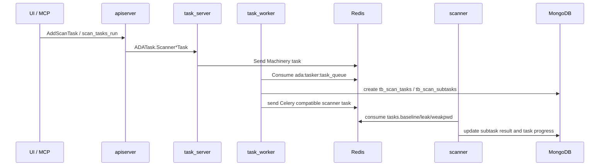

# 后端 API、认证与任务调度

后端分为对外 API 层和内部任务层。apiserver 面向前端、MCP 和外部调用者；task_server/task_worker 负责异步任务、定时任务、syslog 接收和事件处理。

## apiserver

入口：

- `backend/apiserver/cmd/apiserver.go`
- `backend/apiserver/service/service.go`
- `backend/apiserver/api/v2/ada.proto`

启动过程：

1. 从 `APISERVER_CONF_PATH` 或 `./apiserver.yaml` 加载配置。
2. 初始化 Redis、MongoDB 和日志 hook。
3. 启动 HTTP 服务，提供 `/ping`、`/mcp`、license、WebSSH、Kibana proxy 等端点。
4. 初始化 `ADAServiceV2` 并启动 gRPC 服务。

## gRPC API 范围

`backend/apiserver/api/v2/ada.proto` 定义了主要业务接口：

| 领域 | 代表接口 |
| --- | --- |
| 用户和认证 | `Login`、`Logout`、`ListUser`、`EnableMfa`、`GenerateAccessKey` |
| 域管理 | `ListDomain`、`AddDomain`、`UpdateDomainData`、`DeploySensor` |
| Sensor 管理 | `ListSensor`、`UpdateSensor`、`CmdSensor`、`DownloadSensor`、`UpdateSensorVersion` |
| 系统管理 | `GetSystemInfo`、`GetSystemStats`、`NetworkDebug`、`GetLicense` |
| 通知和导出 | `ListNotifyConf`、`AddExportTask`、`ListAuditLog`、`ListSystemLogs` |
| 威胁检测 | `ListThreat`、`GetThreat`、`ActionThreat`、`ListActivity` |
| 规则管理 | `ListAlertRule`、`AddAlertRule`、`ListActivityRule`、`AddActivityRule` |
| 主动扫描 | `ScanRiskStats`、`ListBaseline`、`ListLeak`、`ListWeakPwd`、`AddScanTask` |
| Dashboard | `DashboardStats`、`DashboardTrends`、`DashboardLogStats` |

## 认证和鉴权

apiserver 使用 gRPC unary interceptor 串联：

- recovery
- handler/context 注入
- logging/audit
- validator
- authentication/authorization

认证方式：

- 用户登录后使用 JWT Bearer token。
- MCP 也支持 AccessKey secret hash 认证，认证成功后会复用与 gRPC 相同的用户身份和 ACL 逻辑。

鉴权要点：

- 白名单接口包括登录、MFA 检查、登出和 license 相关接口。
- 其他接口需要从 metadata 中取 `authorization: Bearer <token>`。
- apiserver 会更新用户或 AccessKey 的活跃时间，但做了节流，避免每次请求都写 MongoDB。

## MCP

入口：

- HTTP 路径：`/mcp`
- nginx 转发：`location = /mcp`
- 实现：`backend/apiserver/service/mcp.go`

MCP server 使用 `modelcontextprotocol/go-sdk` 的 streamable HTTP handler，工具调用最终复用 `ADAServiceV2` 的已有业务方法。

当前工具面：

| 领域 | 工具 |
| --- | --- |
| 告警 | `alerts_list`、`alerts_get`、`alerts_dispose` |
| 关联告警规则 | `alert_rules_list`、`alert_rules_add`、`alert_rules_update`、`alert_rules_delete` |
| Sigma/activity 规则 | `activity_rules_list`、`activity_rules_add`、`activity_rules_update`、`activity_rules_delete` |
| 主动扫描结果 | `scan_baselines_list`、`scan_baselines_get`、`scan_vulnerabilities_list`、`scan_weak_passwords_list` |
| 扫描任务 | `scan_tasks_list`、`scan_tasks_get`、`scan_tasks_run`、`scan_tasks_recheck` |

设计原则：

- MCP 不直接绕过业务层读写数据库。
- 每个工具调用先执行与 gRPC 一致的权限检查。
- 返回值通过 protobuf JSON 转成普通 map，便于 MCP 客户端消费。

## task_server

入口：

- `backend/tasker/cmd/server/main.go`
- `backend/tasker/server/server.go`
- `backend/tasker/api/ada_task.proto`

启动后同时运行：

- gRPC server：内部任务 API，默认 `127.0.0.1:8802`。
- HTTP server：内部 HTTP mux，默认 `127.0.0.1:8803`。
- cron scheduler：周期性任务和动态扫描计划。
- pubsub server：sensor 状态事件、LDAP 搜索事件。
- syslog server：winlog 和 tshark pktlog 接收，默认 `0.0.0.0:9092/udp`。
- pktlog pubsub consumer：订阅 Zeek RedisWriter 发布的 `ada:pktlog_channel`。

## task_worker

入口：

- `backend/tasker/cmd/worker/main.go`
- `backend/tasker/worker/worker.go`
- `backend/tasker/tasks/tasks.go`

task_worker 使用 Machinery，默认队列 `ada:tasker:task_queue`，worker 并发数为 64。注册任务包括：

- `domain_sync_task`
- `ad_ldap_sync_task`
- `system_sync_task`
- `rule_sync_task`
- `scanner_baseline_task`
- `scanner_leak_task`
- `scanner_weakpwd_task`
- `scanner_recheck_task`
- `threat_notify_task`
- `system_notify_task`
- `export_report_task`

## 主动扫描调用链

关键点：

- apiserver 只校验参数和发起内部任务。
- task_worker 负责把业务任务拆成子任务。
- scanner 才是真正运行插件的地方。
- task 状态同时涉及 Machinery result backend、MongoDB 任务表和 scanner Celery 兼容结果。
