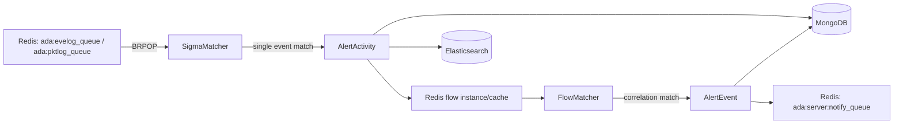

# Rule Engine and Threat Detection

engine converts raw logs into threat activity and threat events that can be viewed and handled. It consumes Redis log queues, first running single-event Sigma matching, then multi-event Flow correlation.

## Startup Entrypoints

Entrypoint files:

- `engine/cmd/engine.go`
- `engine/config/config.go`
- `engine/core/core.go`
- `engine/core/match.go`

Startup flow:

1. Load Redis, MongoDB, ES, and logging configuration from `ENGINE_CONF_PATH` or `./engine.yaml`.
2. Load Flow rules from `/home/adadmin/rules/flow`.
3. Load winlog Sigma rules from `/home/adadmin/rules/winlog`.
4. Load pktlog Sigma rules from `/home/adadmin/rules/pktlog`.
5. Cache Sigma field mappings used by Flow correlation in Redis.
6. Ensure the `ada-activity` ES index exists.
7. Start the rule reload listener, FlowMatcher, FlowCleaner, and SigmaMatcher.

## Detection Pipeline



## Sigma Single-Event Rules

Rule directories:

- `engine/rules/winlog`
- `engine/rules/pktlog`

Rule fields are defined in `engine/sigma/rule.go`. Core fields include:

| Field | Description |
| --- | --- |
| `id` | Rule ID; winlog and pktlog rules should remain unique |
| `title` | Rule title |
| `description` | Rule description |
| `level` | Risk level, supporting `info/low/medium/high/critical` or `1..5` |
| `tags` | ATT&CK and other tags; at least one is required |
| `logsource` | Log source |
| `detection` | Sigma detection expression |
| `fields` | Fields extracted after a match |
| `unique_fields` | Fields used to generate `unique_id` |
| `rdx_key` | Built-in rule cache key, usable as context for later rules |

Match output:

- A hit generates `AlertActivityESDB`.
- The record is written to MongoDB collection `tb_alert_activity`.
- The MongoDB ObjectID is used as the ES doc id for `ada-activity`.
- If the rule participates in Flow correlation, activity metadata is written to the Redis flow cache.

## Flow Multi-Event Correlation Rules

Rule directory:

- `engine/rules/flow`

Supported event types in Flow rules:

| Type | Description |
| --- | --- |
| `count` | The same type of activity reaches a count threshold within a window |
| `multi_eve` | Correlation across multiple eventlog activities |
| `multi_pkt` | Correlation across multiple pktlog activities |
| `multi_eve_pkt` | Mixed eventlog and pktlog correlation |

Flow source validation is strict:

- `multi_eve` can only reference `winlog-*` Sigma rules.
- `multi_pkt` can only reference `pktlog-*` Sigma rules.
- `multi_eve_pkt` must reference both `winlog-*` and `pktlog-*` Sigma rules.

Core Redis keys:

- `ada:engine:flow_rule_map`: mapping from Sigma rule id to Flow id.
- `ada:engine:flow_field_map`: field set for whitelist/display by Flow id.
- `ada:engine:instance:<flow_id>_<instance_key>`: activity zset for a Flow instance. The key comes from Flow `cache_key` when configured, otherwise the legacy Sigma `unique_id`.
- `ada:engine:active:<flow_id>`: active Flow instance set, avoiding full `KEYS` scans.
- `ada:engine:activity_cache:<mongo_id>`: activity metadata cache.
- `ada:engine:ldap_search_channel`: async `$v.ldap` cache-miss request channel.
- `ada:engine:ldap_search_pending:<hash>`: 60s deduplication key for repeated `$v.ldap` misses.

Flow lifecycle:

1. Sigma matches an activity.
2. engine queries `flow_rule_map` to decide whether the Sigma rule participates in a Flow.
3. If it participates, the activity is written to the corresponding Flow instance zset. Flow `cache_key` can normalize fields such as domain, username, or IP so winlog and pktlog activities enter the same instance.
4. `FlowMatcher` scans active instances every second.
5. After a successful match, engine generates `AlertEventESDB`, writes it to `tb_alert_event`, and pushes a notification to Redis.
6. `FlowCleaner` runs every 2 minutes to clean expired activity cache entries and zset members outside the window.

### Flow `match_by`

`match_by` now uses an AST parser rather than an `AND`-only splitter. It supports:

- Boolean operators: `AND`, `OR`, and `NOT`.
- Parentheses, with default precedence `NOT > AND > OR`.
- Leaf operators: `== != > >= < <= in`.
- `$v.cache.key_...(...)` and `$v.ldap.key_...(...)` lookup templates.

Example:

```yaml
match_by: "($s1.UserName == $s2.TargetUserName OR $s1.UserSid == $s2.TargetUserSid) AND NOT ($s1.TargetDomainName == blocked)"
```

### Count Rules

`count` Flow rules support these forms:

```yaml
match_by: "$s1._count >= 5"
match_by: "len($s1) >= 5"
match_by: "len(distinct($s1.TargetUserName)) >= 3"
match_by: "$s1.TargetUserName._count >= 3"
```

`len(distinct($s1.Field))` and `$s1.Field._count` count distinct values after `trim + lower`; all count forms support `== != > >= < <=`.

### `$v.ldap` Lookup

`$v.ldap` keeps LDAP out of the FlowMatcher hot path:

1. FlowMatcher builds the Redis set key and runs `SMEMBERS`.
2. If the set is present, matching completes synchronously.
3. If the set is missing or empty, engine writes `ada:engine:ldap_search_pending:<hash>` with a 60s TTL and publishes a JSON lookup request to `ada:engine:ldap_search_channel`.
4. tasker receives the request, reads the domain LDAP account from Redis, queries LDAP asynchronously, and writes the Redis set with a 60s TTL.

Supported LDAP-backed sets are `sensitive_users`, `sensitive_groups`, and `sensitive_computers`. `honeypot_accounts` remains manual or pre-populated cache.

### ES Bulk Writer

`core.ESIndexer` batches activity writes to `ada-activity`. It now retries failed bulk requests up to 3 times with exponential backoff, then drops the batch and records counters in `ESIndexerStats`:

- `EnqueuedItems`
- `FlushBatches`
- `IndexedItems`
- `RetryAttempts`
- `FailedBatches`
- `DroppedItems`
- `LastError`

## Rule Hot Reload

Hot reload can be triggered by:

- Sending `SIGHUP` to the engine process.
- Publishing a reload message to Redis pubsub channel `ada:engine:reload`.

Hot reload rereads:

- Flow rules
- winlog Sigma rules
- pktlog Sigma rules

It then atomically replaces the in-memory ruleset and refreshes rule field caches in Redis.

## Common Troubleshooting Path

1. Check whether logs enter `ada:evelog_queue` and `ada:pktlog_queue`.
2. Check engine logs for loaded winlog, pktlog, and flow rulesets.
3. Check whether `tb_alert_activity` has new records.
4. Check whether `ada-activity` has new documents.
5. If activity exists but event does not, check `ada:engine:flow_rule_map` and Flow instance keys.
6. If `$v.ldap` is used, check the Redis lookup set, `ada:engine:ldap_search_pending:<hash>`, and tasker logs for `ada:engine:ldap_search_channel`.
7. If ES indexing lags, inspect ES bulk retry logs and `ESIndexerStats`.
8. If rules were just changed, confirm that `ada:engine:reload` was triggered or engine was restarted.
