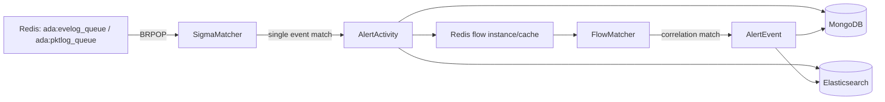

# 规则引擎与威胁检测

engine 负责把原始日志转换成可展示、可处置的威胁活动和威胁事件。它消费 Redis 日志队列，先做单事件 Sigma 匹配，再做多事件 Flow 关联。

## 启动入口

入口文件：

- `engine/cmd/engine.go`
- `engine/config/config.go`
- `engine/core/core.go`
- `engine/core/match.go`

启动过程：

1. 从 `ENGINE_CONF_PATH` 或 `./engine.yaml` 加载 Redis、MongoDB、ES 和日志配置。
2. 从 `/home/adadmin/rules/flow` 加载 Flow 规则。
3. 从 `/home/adadmin/rules/winlog` 加载 winlog Sigma 规则。
4. 从 `/home/adadmin/rules/pktlog` 加载 pktlog Sigma 规则。
5. 将 Flow 关联的 Sigma 字段映射缓存到 Redis。
6. 确保 `ada-activity` ES index 存在。
7. 启动 license runtime check、规则 reload 监听、FlowMatcher、FlowCleaner 和 SigmaMatcher。

## 检测链路

## Sigma 单事件规则

规则目录：

- `engine/rules/winlog`
- `engine/rules/pktlog`

规则字段由 `engine/sigma/rule.go` 定义，核心字段包括：

| 字段 | 说明 |
| --- | --- |
| `id` | 规则 ID，winlog/pktlog 规则应保持唯一 |
| `title` | 规则标题 |
| `description` | 规则描述 |
| `level` | 风险等级，支持 `info/low/medium/high/critical` 或 `1..5` |
| `tags` | ATT&CK 等标签，至少需要一个 |
| `logsource` | 日志来源 |
| `detection` | Sigma detection 表达式 |
| `fields` | 命中后提取字段 |
| `unique_fields` | 生成 `unique_id` 的字段 |
| `rdx_key` | 内置规则缓存 key，可用于给后续规则提供上下文 |

匹配输出：

- 命中后生成 `AlertActivityESDB`。
- 写入 MongoDB collection `tb_alert_activity`。
- 以 MongoDB ObjectID 作为 ES doc id 写入 `ada-activity`。
- 如果规则关联 Flow，则把 activity 元信息写入 Redis flow cache。

## Flow 多事件关联规则

规则目录：

- `engine/rules/flow`

Flow 规则支持的事件类型：

| 类型 | 说明 |
| --- | --- |
| `count` | 同一窗口内同类 activity 达到次数阈值 |
| `multi_eve` | 多条 eventlog activity 关联 |
| `multi_pkt` | 多条 pktlog activity 关联 |
| `multi_eve_pkt` | eventlog 和 pktlog 混合关联 |

核心 Redis key：

- `ada:engine:flow_rule_map`：sigma rule id 到 flow id 的映射。
- `ada:engine:flow_field_map`：flow id 到可用于白名单/展示的字段集合。
- `ada:engine:instance:<flow_id>_<unique_id>`：Flow instance 的 activity zset。
- `ada:engine:active:<flow_id>`：活跃 Flow instance 集合，避免全量 `KEYS` 扫描。
- `ada:engine:activity_cache:<mongo_id>`：activity 元信息缓存。

Flow 生命周期：

1. Sigma 命中 activity。
2. engine 查询 `flow_rule_map`，判断该 Sigma 是否参与某个 Flow。
3. 如果参与，将 activity 写入对应 Flow instance zset。
4. `FlowMatcher` 每秒扫描活跃 instance。
5. 匹配成功后生成 `AlertEventESDB`，写入 `tb_alert_event` 和 ES。
6. `FlowCleaner` 每 2 分钟清理超出窗口的 activity cache 和 zset member。

## 规则热加载

热加载触发方式：

- 发送 `SIGHUP` 到 engine 进程。
- 向 Redis pubsub channel `ada:engine:reload` 发布 reload 消息。

热加载会重新读取：

- Flow 规则
- winlog Sigma 规则
- pktlog Sigma 规则

然后原子替换内存中的 ruleset，并刷新 Redis 中的规则字段缓存。

## License 影响

engine 启动后会周期性执行 runtime check：

- license 初始化失败时进入 pending 状态，暂停处理数据，但不会立即退出。
- license 过期时进入 pending 状态。
- delay expired 条件满足时停止 engine。

排障时需要区分：

- Redis 队列有积压但 engine 不消费。
- engine 正在 pending。
- 规则加载失败导致启动失败。
- ES disabled 只影响 ES 写入，不应阻止 MongoDB activity 生成。

## 常见排查路径

1. 检查 `ada:evelog_queue` 和 `ada:pktlog_queue` 是否有日志进入。
2. 检查 engine 日志中是否加载 winlog、pktlog、flow ruleset。
3. 检查 `tb_alert_activity` 是否新增记录。
4. 检查 `ada-activity` 是否新增文档。
5. 如果只有 activity 没有 event，检查 `ada:engine:flow_rule_map` 和 Flow instance key。
6. 如果规则刚修改，确认是否触发 `ada:engine:reload` 或重启 engine。
