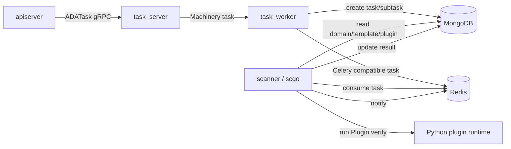

# Active Scanning System

scanner executes active checks, including baseline, leak, and weakpwd. It is not called directly by the frontend or apiserver; tasks are orchestrated by tasker and then distributed through Redis task queues.

## Component Boundaries

## scanner Process

Entrypoints:

- `scanner/cmd/scanner.go`
- `scanner/worker/worker.go`
- `scanner/scgo/service.go`

Startup flow:

1. Load Redis and MongoDB configuration from `SCANNER_CONF_PATH` or default configuration.
2. Generate a runtime random value and write it to Redis `ada:rand_key` for runtime validation.
3. After license and random value validation pass, decrypt and release embedded scan packages.
4. Initialize `scgo.Service`.
5. Register scan plugins and templates into MongoDB.
6. Start the Celery-compatible worker.

## scgo Responsibilities

`scanner/scgo` is the Go implementation of the scan worker. It replaces the previous Python Celery worker for task consumption and state management, while plugin execution still depends on Python:

- Go consumes Redis tasks, updates MongoDB task state, pushes notifications, and registers plugins and templates.
- Python only imports protected `.so` plugins and executes `Plugin.verify()`.

Plugin execution goes through `RunPluginVerify`:

1. Go assembles kwargs.
2. Go passes `SC_ROOT`, `PLUGIN_MODULE`, and `PLUGIN_KWARGS_B64` to Python through environment variables.
3. Python dynamically imports `plugins.<category>.plugin_<id>.main`.
4. Python calls `Plugin(**kwargs).verify()`.
5. Python prints the result as `__RESULT__<json>`.
6. Go parses the result and updates MongoDB.

## Task Types

| Type | Task name | Description |
| --- | --- | --- |
| baseline | `tasks.baseline.execute_baseline` | Baseline configuration/policy checks |
| leak | `tasks.leak.execute_leak` | Vulnerability checks, usually split by DC |
| weakpwd | `tasks.weakpwd.execute_weakpwd` | Weak password checks, split by user groups |

## How task_worker Splits Scan Tasks

Code entrypoint:

- `backend/tasker/worker/scanner.go`

baseline:

- Generate one `tb_scan_tasks` record for each domain/template.
- Generate one `tb_scan_subtasks` record for each plugin.
- Subtask kwargs include `plugin_id`, `group_id`, `domain`, and `template_id`.

leak:

- Generate one `tb_scan_tasks` record for each domain/template.
- Generate one subtask for each DC and plugin combination.
- Subtask kwargs additionally include `hostname`.

weakpwd:

- Read domain users from `tb_asset_user`, excluding `Guest`, `DefaultAccount`, and `krbtgt`.
- If `tb_domain_<domain>_hash` exists, use incremental scan logic; otherwise run a full scan.
- Split users into groups of 300.
- Subtask kwargs include `user_list` and `scan_type`.

## MongoDB Task Tables

| Collection | Description |
| --- | --- |
| `tb_scan_plugin` | Scan plugin metadata |
| `tb_scan_template` | Scan templates, including plugin lists |
| `tb_scan_conf` | Periodic scan configuration |
| `tb_scan_tasks` | Scan parent task table |
| `tb_scan_subtasks` | Scan subtasks and plugin results |
| `tb_domain_<domain>_hash` | Domain user hash cache for weak-password scans |

## State Transitions

Common states:

- `PENDING`
- `RUNNING`
- `FINISH`
- `FAILURE`

Basic flow:

1. task_worker creates parent tasks and subtasks.
2. After scanner consumes a subtask, it marks the parent task or subtask as `RUNNING`.
3. After the plugin returns, scanner writes subtask `result`, `error_msg`, and `update_tm`.
4. scanner increments parent task `subtasks_finish`.
5. After all subtasks finish, scanner marks the parent task as `FINISH` or `FAILURE` according to results.

## Plugin Context

scanner provides plugins with the main context below:

- `dc_conf`: domain controller address, hostname, platform, LDAP configuration, and related data.
- `meta_data`: plugin configuration metadata.
- `env.mongo_conf`: MongoDB configuration needed by plugins.
- `_task_id`: Celery compatibility and state tracking.

baseline uses online DCs; leak uses the DC with the specified hostname; weakpwd selects a DC where SMB `445` is reachable.

## Runtime Notes

- `.so` plugins are often bound to a specific CPython version; do not assume that the local development Python version can run them directly.
- `scanner/worker/worker.go` cleans `.sc` and `.venv` under the runtime directory, so pay attention to the log and temporary directory lifecycle during troubleshooting.
- `SCANNER_CONCURRENCY` can override scgo worker concurrency.
- Redis and MongoDB configuration support environment variable overrides for container deployment.
