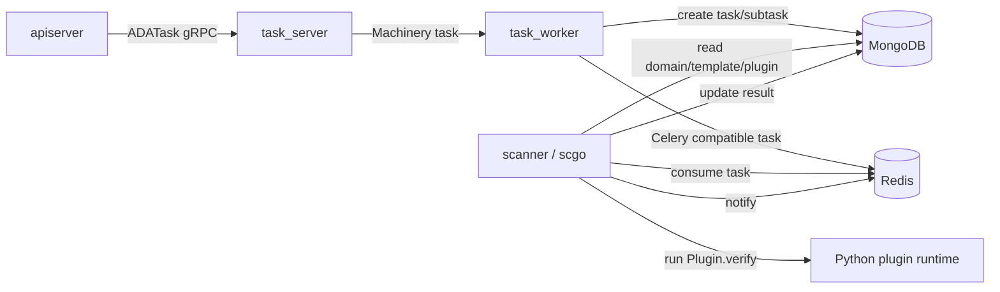

# 主动扫描系统

scanner 负责执行主动检测，包括 baseline、leak 和 weakpwd。它不是直接由前端或 apiserver 调用，而是通过 tasker 编排后由 Redis 任务队列分发。

## 组件边界

## scanner 进程

入口：

- `scanner/cmd/scanner.go`
- `scanner/worker/worker.go`
- `scanner/scgo/service.go`

启动过程：

1. 从 `SCANNER_CONF_PATH` 或默认配置加载 Redis 和 MongoDB。
2. 生成 runtime 随机数，并写入 Redis `ada:rand_key` 做运行时校验。
3. license 和随机数校验通过后，解密并释放内嵌扫描包。
4. 初始化 `scgo.Service`。
5. 扫描插件和模板注册到 MongoDB。
6. 启动 Celery 兼容 worker。

## scgo 的职责

`scanner/scgo` 是扫描 worker 的 Go 实现，替代原先 Python Celery worker 的任务消费和状态管理，但插件执行仍然依赖 Python：

- Go 负责消费 Redis task、更新 MongoDB 任务状态、推送通知、注册插件和模板。
- Python 只负责导入受保护的 `.so` 插件并执行 `Plugin.verify()`。

插件运行通过 `RunPluginVerify`：

1. Go 组装 kwargs。
2. 通过环境变量把 `SC_ROOT`、`PLUGIN_MODULE`、`PLUGIN_KWARGS_B64` 传给 Python。
3. Python 动态 import `plugins.<category>.plugin_<id>.main`。
4. 调用 `Plugin(**kwargs).verify()`。
5. Python 以 `__RESULT__<json>` 输出结果。
6. Go 解析结果并更新 MongoDB。

## 任务类型

| 类型 | task name | 说明 |
| --- | --- | --- |
| baseline | `tasks.baseline.execute_baseline` | 基线配置/策略类检测 |
| leak | `tasks.leak.execute_leak` | 漏洞类检测，通常按 DC 拆分 |
| weakpwd | `tasks.weakpwd.execute_weakpwd` | 弱口令检测，按用户分组拆分 |

## task_worker 如何拆分扫描任务

代码入口：

- `backend/tasker/worker/scanner.go`

baseline：

- 每个 domain/template 生成一个 `tb_scan_tasks`。
- 每个 plugin 生成一个 `tb_scan_subtasks`。
- 子任务 kwargs 包含 `plugin_id`、`group_id`、`domain`、`template_id`。

leak：

- 每个 domain/template 生成一个 `tb_scan_tasks`。
- 每个 DC 和每个 plugin 组合生成一个 subtask。
- 子任务 kwargs 额外包含 `hostname`。

weakpwd：

- 先从 `tb_asset_user` 读取域用户列表，忽略 `Guest`、`DefaultAccount`、`krbtgt`。
- 如果存在 `tb_domain_<domain>_hash`，按增量扫描处理，否则全量扫描。
- 用户按每组 300 个拆分。
- 子任务 kwargs 包含 `user_list` 和 `scan_type`。

## MongoDB 任务表

| Collection | 说明 |
| --- | --- |
| `tb_scan_plugin` | 扫描插件元数据 |
| `tb_scan_template` | 扫描模板，包含插件列表 |
| `tb_scan_conf` | 周期扫描配置 |
| `tb_scan_tasks` | 扫描任务主表 |
| `tb_scan_subtasks` | 扫描子任务和插件结果 |
| `tb_domain_<domain>_hash` | 弱口令扫描的域用户 hash 缓存 |

## 状态流转

常见状态：

- `PENDING`
- `RUNNING`
- `FINISH`
- `FAILURE`

基本流转：

1. task_worker 创建主任务和子任务。
2. scanner 消费子任务后把主任务或子任务置为 `RUNNING`。
3. 插件返回后，scanner 写入子任务 `result`、`error_msg` 和 `update_tm`。
4. scanner 增加主任务 `subtasks_finish`。
5. 所有子任务完成后，scanner 根据结果把主任务置为 `FINISH` 或 `FAILURE`。

## 插件上下文

scanner 给插件的主要上下文：

- `dc_conf`：域控地址、主机名、平台、LDAP 配置等。
- `meta_data`：插件配置元数据。
- `env.mongo_conf`：插件访问 MongoDB 所需配置。
- `_task_id`：用于 Celery 兼容和状态追踪。

baseline 使用在线 DC；leak 使用指定 hostname 的 DC；weakpwd 选择 SMB `445` 可用的 DC。

## 运行注意事项

- `.so` 插件通常绑定特定 CPython 版本，不能假设开发机的 Python 版本可直接运行。
- `scanner/worker/worker.go` 会清理运行目录下的 `.sc` 和 `.venv`，排障时注意日志和临时目录生命周期。
- `SCANNER_CONCURRENCY` 可覆盖 scgo worker 并发数。
- Redis、MongoDB 配置支持环境变量覆盖，便于容器部署。
