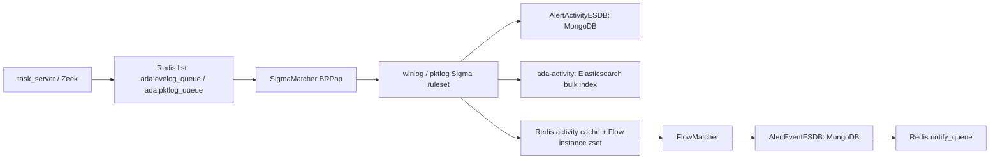

# Engine 模块说明

`engine` 是 ADAegis 的规则匹配与多事件关联模块。它消费 Redis 中的 eventlog/pktlog 队列，先用 Sigma 规则把单条日志转成 activity，再用 Flow 规则把多个 activity 关联成 threat event。

## 本轮实现结论

| 能力 | 状态 | 说明 |
| --- | --- | --- |
| `multi_pkt_winlog` | 已按 `multi_eve_pkt` 实现 | Flow 规则可同时引用 `winlog-*` 与 `pktlog-*` Sigma 规则，执行路径复用通用 sequence matcher。 |
| Flow cache key | 已实现 | Flow 规则可通过 `detection.cache_key` 显式声明不同 Sigma activity 的 instance 分桶键，解决 winlog/pktlog `unique_id` 不一致导致无法混合关联的问题。 |
| cache key 相关 issue | 已修复关键项 | 动态 `$v.cache.key_...($sN.Field)` 参数字段会进入 `ExtFields`；`>=`/`<=` 解析顺序修复；非法 `$sN` 会在规则加载时跳过，避免运行时 panic。 |

注意：引擎能力已经具备，但仓库内仍需要继续补充真实 pktlog Sigma 规则和业务级 `multi_eve_pkt` Flow 规则，才能产生具体的混合关联告警。

## 模块边界

| 路径 | 作用 |
| --- | --- |
| `cmd/engine.go` | 进程入口，初始化配置、规则热加载、SigmaMatcher、FlowMatcher、FlowCleaner。 |
| `config/` | Redis、MongoDB、Elasticsearch、日志配置初始化。 |
| `core/` | 队列消费、Sigma 命中处理、activity 入库、activity cache、Flow cache 写入、规则重载。 |
| `flow/` | Flow 规则加载、`match_by` 解析、窗口关联、白名单、event 存储和通知推送。 |
| `sigma/` | Sigma YAML 解析、条件 AST、单条日志匹配、字段提取和 `unique_id` 生成。 |
| `rules/winlog` | Windows eventlog Sigma 规则。 |
| `rules/pktlog` | packetlog Sigma 规则。当前仍需要扩展真实检测规则。 |
| `rules/flow` | 多事件关联规则。现在支持 winlog、pktlog、winlog+pktlog 混合关联。 |

## 运行链路



核心 Redis key：

| Key | 类型 | 用途 |
| --- | --- | --- |
| `ada:evelog_queue` | list | eventlog 输入队列。 |
| `ada:pktlog_queue` | list | pktlog 输入队列。 |
| `ada:engine:flow_rule_map` | hash | `sigma_id -> flow_id,flow_id`，用于 Sigma 命中后判断是否进入 Flow。 |
| `ada:engine:flow_field_map` | hash | `flow_id -> fields`，后端白名单字段接口读取。 |
| `ada:engine:activity_cache_<mongo_id>` | hash | 单条 activity 的关联字段缓存，TTL 6 小时。 |
| `ada:engine:instance:<flow_id>_<instance_key>` | zset | 某个 Flow instance 的 activity 时间序列。`instance_key` 优先来自 Flow `cache_key`，未配置时兼容使用 Sigma `unique_id`。 |
| `ada:engine:active:<flow_id>` | set | 活跃 instance key 集合，避免每轮全量 `KEYS`。 |
| `ada:engine:flow_whitelist:<flow_id>` | hash | Flow 白名单条件。 |
| `ada:engine:reload` | pubsub | 规则热加载触发通道。 |

## Flow 类型

| 类型 | 当前实现 |
| --- | --- |
| `count` | 同一窗口内同类 activity 达到次数阈值。 |
| `multi_eve` | 多条 `winlog-*` activity 关联。 |
| `multi_pkt` | 多条 `pktlog-*` activity 关联，已与 `multi_eve` 对齐 sequence matcher、白名单和清理流程。 |
| `multi_eve_pkt` | `winlog-*` 与 `pktlog-*` 混合关联，要求规则中同时包含两类 Sigma id。 |

规则加载会校验事件类型与 Sigma id 前缀：

- `multi_eve` 只能引用 `winlog-*`。
- `multi_pkt` 只能引用 `pktlog-*`。
- `multi_eve_pkt` 必须同时引用 `winlog-*` 和 `pktlog-*`。

## cache_key 规则写法

`detection.cache_key` 用于让 Flow 显式控制 activity 如何进入同一个 instance。没有配置 `cache_key` 的旧规则仍使用 Sigma `unique_id`，保持兼容。

```yaml
detection:
  event_type: multi_eve_pkt
  win_size: 60s
  sorted: false
  sigma_rules:
    - "winlog-0104-0001"
    - "pktlog-0200-0001"
  cache_key:
    winlog-0104-0001:
      - "TargetDomainName|domain"
      - "TargetUserName|lower|trim"
    pktlog-0200-0001:
      - "Domain|domain"
      - "UserName|lower|trim"
  match_by: "$s1.TargetUserName == $s2.UserName AND $s1.TargetDomainName == $s2.Domain"
```

支持的 normalizer：

| normalizer | 说明 |
| --- | --- |
| `trim` | 去除首尾空白。 |
| `lower` | 转小写。 |
| `domain` | 域名归一化；例如 `EXAMPLE` 可结合 `dc01.example.com` 归一化成 `example.com`。 |
| `ip` | 使用 `net.ParseIP` 归一化 IP 字符串。 |

运行时行为：

1. Sigma 命中后，`syncFlowEngine` 根据 `flow_rule_map` 找到关联 Flow。
2. 如果 Flow 对该 Sigma 配置了 `cache_key`，则按列表顺序取归一化后的字段值生成稳定 hash 作为 instance key；hash 不包含原始字段名，因此 `TargetUserName` 与 `UserName` 这类同义字段可以跨日志源对齐。
3. 如果未配置 `cache_key`，使用原有 `result.UniqueId`。
4. 如果配置了但字段缺失，当前 activity 不写入该 Flow instance，避免污染全局分桶。

## `$v.cache` 右值查询

`match_by` 仍支持 Redis set 类型右值查询：

```yaml
match_by: "$s1.TargetUserName in $v.cache.key_ada:engine:%s:sensitive_users($s1.TargetDomainName)"
```

本轮修复后，动态 key 参数里的 `$sN.Field` 也会加入对应 Sigma rule 的 `fields`，确保字段会被提取到 activity cache。规则加载还会校验：

- cache key 必须以 `key_` 开头。
- `%s` 数量必须等于括号里的 `$sN.Field` 参数数量。
- `$sN` 下标必须在 `sigma_rules` 范围内。

## 已修复的问题

1. `multi_eve_pkt` 从空实现改为可执行混合关联。
2. `multi_pkt` 复用通用 sequence matcher，补齐白名单与清理行为。
3. Flow instance key 支持由 Flow 规则显式定义，解决跨日志源 `unique_id` 不一致的问题。
4. Flow YAML 省略 `enable` 时默认启用；显式 `enable: false` 才禁用。
5. Flow 规则重复 id 会被真正跳过。
6. Flow 规则加载每个文件使用独立结构体，避免 YAML 缺失字段继承上一条规则。
7. 非法 `$sN` 会在加载阶段跳过规则，避免 `extractFields` 或运行期 panic。
8. `>=`、`<=` 操作符解析顺序修复。
9. `$v.cache` 动态 key 参数字段会进入 `ExtFields`。
10. `unique_filter` 改为基于实际命中的 activity 组合，而不是窗口内全部 activity。
11. `count` 告警后清理 zset 的时间戳单位修复为毫秒。

## 剩余 Future

- 仓库内需要补充真实 pktlog Sigma 规则和业务级 `multi_eve_pkt` Flow 规则。
- Flow `match_by` 仍然是轻量解析器，只支持 `AND`，后续可升级为完整 AST，支持 `OR`、括号和 `not`。
- `count` 规则仍只支持 `$s1._count == N`，后续可扩展 `>=`、`len($s1) >= N`、按字段去重计数。
- `$v.ldap` 仍未实现；建议先明确使用 Redis 同步缓存还是异步 LDAP 查询，避免在 FlowMatcher 热路径里阻塞。
- Flow event 目前只写 MongoDB 和 notify 队列，尚未建立 event ES 索引。
- ES bulk writer 仍是 best-effort，失败只记录日志，后续应增加有限重试和指标。
- license pending 状态目前主要影响 FlowMatcher，SigmaMatcher 是否暂停消费还需要统一语义。

## 验证

本轮新增了 Flow/Core 单元测试，覆盖：

- Flow cache key 归一化和 fallback。
- `$v.cache` 动态参数字段提取。
- `>=`/`<=` 操作符解析。
- 非法 `$sN` 规则加载防护。
- `multi_eve_pkt` 混合关联生成 event。
- `syncFlowEngine` 按 Flow cache key 写入 Redis instance。

推荐回归命令：

```shell
GOCACHE=/tmp/ada-go-build go test ./engine/...
```
