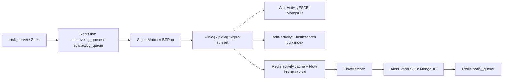

# Engine Module

`engine` is the ADAegis rule matching and multi-event correlation module. It consumes eventlog and pktlog Redis queues, turns single raw logs into Sigma activities, and correlates those activities into threat events with Flow rules.

## Current Status

| Capability | Status | Notes |
| --- | --- | --- |
| License runtime check removal | Done | `ada_engine` no longer starts `RuntimeCheck`; `EngineWorker` no longer keeps a license pending state. FlowMatcher and SigmaMatcher are controlled by process context and stop state only. |
| Mixed winlog + pktlog Flow | Done | Implemented as `multi_eve_pkt`; Flow rules can reference both `winlog-*` and `pktlog-*` Sigma rules. |
| Flow cache key | Done | `detection.cache_key` lets each Flow rule define stable instance keys across different log sources and field names. |
| `match_by` AST | Done | Supports `AND`, `OR`, parentheses, and `NOT`, with `NOT > AND > OR` precedence. |
| `count` expressions | Done | Supports `== != > >= < <=`, `$s1._count`, `len($s1)`, `len(distinct($s1.Field))`, and `$s1.Field._count`. |
| `$v.ldap` | Done | FlowMatcher reads Redis synchronously; cache misses are deduplicated for 60s and published to tasker for async LDAP refresh. |
| ES bulk writer | Done | Adds bounded retry, exponential backoff, dropped-batch logging, and `ESIndexerStats`. |

## Layout

| Path | Responsibility |
| --- | --- |
| `cmd/engine.go` | Process entrypoint, configuration, signal handling, rule reload, SigmaMatcher, FlowMatcher, FlowCleaner. |
| `config/` | Redis, MongoDB, Elasticsearch, and logger initialization. |
| `core/` | Queue consumption, Sigma hit handling, activity persistence, activity cache, Flow cache writes, ES bulk indexing, rule reload. |
| `flow/` | Flow rule loading, `match_by` AST parsing, window correlation, whitelist checks, event persistence, `$v.cache` and `$v.ldap` lookup. |
| `sigma/` | Sigma YAML parsing, condition AST, single-log matching, field extraction, and `unique_id` generation. |
| `rules/winlog` | Windows eventlog Sigma rules. |
| `rules/pktlog` | Packetlog Sigma rules. |
| `rules/flow` | Multi-event correlation rules. |

## Runtime Flow



Important Redis keys:

| Key | Type | Purpose |
| --- | --- | --- |
| `ada:evelog_queue` | list | Eventlog input queue. |
| `ada:pktlog_queue` | list | Packetlog input queue. |
| `ada:engine:flow_rule_map` | hash | `sigma_id -> flow_id,flow_id`, used after a Sigma hit. |
| `ada:engine:flow_field_map` | hash | `flow_id -> fields`, read by backend whitelist/display APIs. |
| `ada:engine:activity_cache_<mongo_id>` | hash | Per-activity correlation cache, with 6h TTL. |
| `ada:engine:instance:<flow_id>_<instance_key>` | zset | Activity time series for one Flow instance. |
| `ada:engine:active:<flow_id>` | set | Active instance keys, avoiding repeated full `KEYS` scans. |
| `ada:engine:flow_whitelist:<flow_id>` | hash | Flow whitelist conditions. |
| `ada:engine:reload` | pubsub | Rule hot-reload trigger. |
| `ada:engine:ldap_search_channel` | pubsub | Async `$v.ldap` lookup requests after cache misses. |
| `ada:engine:ldap_search_pending:<hash>` | string | 60s miss deduplication key for `$v.ldap`. |

## Flow Types

| Type | Behavior |
| --- | --- |
| `count` | Triggers when activity count reaches a threshold within the window. |
| `multi_eve` | Correlates multiple `winlog-*` activities. |
| `multi_pkt` | Correlates multiple `pktlog-*` activities. |
| `multi_eve_pkt` | Correlates mixed `winlog-*` and `pktlog-*` activities. |

Rule loading enforces source compatibility:

- `multi_eve` can only reference `winlog-*` Sigma rules.
- `multi_pkt` can only reference `pktlog-*` Sigma rules.
- `multi_eve_pkt` must reference at least one `winlog-*` and one `pktlog-*` Sigma rule.

## `cache_key`

`detection.cache_key` lets a Flow rule explicitly decide how activities enter the same instance. Rules without `cache_key` still use the legacy Sigma `unique_id`.

```yaml
detection:
  event_type: multi_eve_pkt
  win_size: 60s
  sorted: false
  sigma_rules:
    - "winlog-0104-0001"
    - "pktlog-0200-0001"
  cache_key:
    winlog-0104-0001:
      - "TargetDomainName|domain"
      - "TargetUserName|lower|trim"
    pktlog-0200-0001:
      - "Domain|domain"
      - "UserName|lower|trim"
  match_by: "$s1.TargetUserName == $s2.UserName AND $s1.TargetDomainName == $s2.Domain"
```

Supported normalizers are `trim`, `lower`, `domain`, and `ip`.

## `match_by`

`match_by` now uses an AST parser:

```yaml
match_by: "($s1.UserName == $s2.TargetUserName OR $s1.UserSid == $s2.TargetUserSid) AND NOT ($s1.TargetDomainName == blocked)"
```

Rules:

- Boolean keywords are case-insensitive: `AND`, `OR`, `NOT`.
- Parentheses can override precedence.
- Default precedence is `NOT > AND > OR`.
- Leaf conditions support `== != > >= < <= in`.
- Parentheses inside `$v.cache.key_...(...)` and `$v.ldap.key_...(...)` are treated as lookup template parameters.

## `count`

Supported expressions:

```yaml
match_by: "$s1._count >= 5"
match_by: "len($s1) >= 5"
match_by: "len(distinct($s1.TargetUserName)) >= 3"
match_by: "$s1.TargetUserName._count >= 3"
```

Notes:

- `$s1._count` and `len($s1)` count matching activities for the selected Sigma rule.
- `len($s1.Field)` counts non-empty field occurrences.
- `len(distinct($s1.Field))` and `$s1.Field._count` count distinct field values after `trim + lower`.
- Comparators supported: `== != > >= < <=`.

## `$v.cache` and `$v.ldap`

Redis set lookup:

```yaml
match_by: "$s1.TargetUserName in $v.cache.key_ada:engine:%s:sensitive_users($s1.TargetDomainName)"
```

LDAP-backed lookup:

```yaml
match_by: "$s1.TargetUserName in $v.ldap.key_ada:engine:%s:sensitive_users($s1.TargetDomainName)"
```

Runtime behavior:

1. FlowMatcher builds a Redis key from the template, for example `ada:engine:example.com:sensitive_users`.
2. It runs `SMEMBERS` first and matches synchronously when the set is present.
3. On miss, it writes `ada:engine:ldap_search_pending:<hash>` with a 60s TTL to deduplicate requests.
4. The first miss publishes a JSON request to `ada:engine:ldap_search_channel`.
5. tasker asynchronously reads the domain LDAP account, queries LDAP, and writes the Redis set with a 60s TTL.
6. The current FlowMatcher cycle never blocks on LDAP; later cycles use the refreshed cache.

Supported LDAP-backed sets:

| Redis set | LDAP source |
| --- | --- |
| `ada:engine:<domain>:sensitive_users` | Users with `adminCount=1`. |
| `ada:engine:<domain>:sensitive_groups` | Built-in sensitive group list. |
| `ada:engine:<domain>:sensitive_computers` | DC/RODC-style sensitive computers. |
| `ada:engine:<domain>:honeypot_accounts` | Existing/manual cache only; no automatic LDAP lookup. |

## ES Bulk Writer

`core.ESIndexer` now provides bounded retry and internal counters:

- Defaults: `flushMaxItems=200`, `flushInterval=3s`.
- Bulk request failures and error responses retry up to 3 times.
- Retry backoff starts at 200ms and caps at 2s per wait.
- Exhausted batches are dropped with `FailedBatches`, `DroppedItems`, and `LastError` updated.
- `Stats()` exposes `EnqueuedItems`, `FlushBatches`, `IndexedItems`, `RetryAttempts`, `FailedBatches`, and `DroppedItems`.

## Remaining Future Work

- Add more real pktlog Sigma rules and business-level `multi_eve_pkt` Flow rules.
- Add a threat-event Elasticsearch index if the product needs Flow events searchable outside MongoDB.
- Extend `$v.ldap` beyond sensitive users/groups/computers when a concrete lookup DSL and cache policy are defined.
- Export `ESIndexerStats` to Prometheus/OpenTelemetry or the existing system metrics pipeline.

## Verification

```shell
GOCACHE=/tmp/ada-go-build go test ./engine/... ./backend/tasker/event
```
