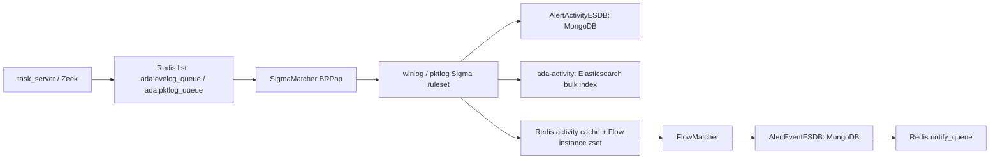

# Engine 模块说明

`engine` 是 ADAegis 的规则匹配与多事件关联模块。它消费 Redis 中的 eventlog/pktlog 队列，先用 Sigma 规则把单条日志转换为 activity，再用 Flow 规则把多个 activity 关联成 threat event。

## 本轮实现结论

| 能力 | 状态 | 说明 |
| --- | --- | --- |
| 移除 license check | 已完成 | `ada_engine` 不再启动 `RuntimeCheck`，`EngineWorker` 也不再维护 license pending 状态；FlowMatcher/SigmaMatcher 只受进程上下文和 stop 状态控制。 |
| `multi_pkt_winlog` | 已按 `multi_eve_pkt` 完成 | Flow 规则可同时引用 `winlog-*` 与 `pktlog-*` Sigma 规则，执行路径复用通用 sequence matcher。 |
| Flow cache key | 已完成 | Flow 规则可通过 `detection.cache_key` 显式声明不同 Sigma activity 的 instance 分桶键，解决 winlog/pktlog `unique_id` 不一致导致无法混合关联的问题。 |
| `match_by` AST | 已完成 | 支持 `AND`、`OR`、括号和 `NOT`，优先级为 `NOT > AND > OR`。 |
| `count` 表达式 | 已扩展 | 支持 `== != > >= < <=`，支持 `$s1._count`、`len($s1)`、`len(distinct($s1.Field))` 和 `$s1.Field._count`。 |
| `$v.ldap` | 已完成热路径方案 | FlowMatcher 先同步读 Redis set；cache miss 时使用 `SETNX` 60s 去重并发布 `ada:engine:ldap_search_channel`，tasker 异步 LDAP 查询后回填 Redis。 |
| ES bulk writer | 已增强 | 增加最多 3 次有限重试、指数退避和 `ESIndexerStats` 指标，重试耗尽后记录 dropped batch。 |

## 模块边界

| 路径 | 作用 |
| --- | --- |
| `cmd/engine.go` | 进程入口，初始化配置、规则热加载、SigmaMatcher、FlowMatcher、FlowCleaner。 |
| `config/` | Redis、MongoDB、Elasticsearch、日志配置初始化。 |
| `core/` | 队列消费、Sigma 命中处理、activity 入库、activity cache、Flow cache 写入、ES bulk 写入、规则重载。 |
| `flow/` | Flow 规则加载、`match_by` AST 解析、窗口关联、白名单、event 存储、通知推送、`$v.cache`/`$v.ldap` 查询。 |
| `sigma/` | Sigma YAML 解析、条件 AST、单条日志匹配、字段提取和 `unique_id` 生成。 |
| `rules/winlog` | Windows eventlog Sigma 规则。 |
| `rules/pktlog` | packetlog Sigma 规则。当前仍需要扩展真实检测规则。 |
| `rules/flow` | 多事件关联规则。支持 winlog、pktlog、winlog+pktlog 混合关联。 |

## 运行链路



核心 Redis key：

| Key | 类型 | 用途 |
| --- | --- | --- |
| `ada:evelog_queue` | list | eventlog 输入队列。 |
| `ada:pktlog_queue` | list | pktlog 输入队列。 |
| `ada:engine:flow_rule_map` | hash | `sigma_id -> flow_id,flow_id`，用于 Sigma 命中后判断是否进入 Flow。 |
| `ada:engine:flow_field_map` | hash | `flow_id -> fields`，后端白名单字段接口读取。 |
| `ada:engine:activity_cache_<mongo_id>` | hash | 单条 activity 的关联字段缓存，TTL 6 小时。 |
| `ada:engine:instance:<flow_id>_<instance_key>` | zset | 某个 Flow instance 的 activity 时间序列。`instance_key` 优先来自 Flow `cache_key`，未配置时兼容使用 Sigma `unique_id`。 |
| `ada:engine:active:<flow_id>` | set | 活跃 instance key 集合，避免每轮全量 `KEYS`。 |
| `ada:engine:flow_whitelist:<flow_id>` | hash | Flow 白名单条件。 |
| `ada:engine:reload` | pubsub | 规则热加载触发通道。 |
| `ada:engine:ldap_search_channel` | pubsub | `$v.ldap` cache miss 后的异步查询请求。 |
| `ada:engine:ldap_search_pending:<hash>` | string | `$v.ldap` miss 去重锁，默认 60s。 |

## Flow 类型

| 类型 | 当前实现 |
| --- | --- |
| `count` | 同一窗口内同类 activity 达到次数阈值。 |
| `multi_eve` | 多条 `winlog-*` activity 关联。 |
| `multi_pkt` | 多条 `pktlog-*` activity 关联，已与 `multi_eve` 对齐 sequence matcher、白名单和清理流程。 |
| `multi_eve_pkt` | `winlog-*` 与 `pktlog-*` 混合关联，要求规则中同时包含两类 Sigma id。 |

规则加载会校验事件类型与 Sigma id 前缀：

- `multi_eve` 只能引用 `winlog-*`。
- `multi_pkt` 只能引用 `pktlog-*`。
- `multi_eve_pkt` 必须同时引用 `winlog-*` 和 `pktlog-*`。

## `cache_key` 规则写法

`detection.cache_key` 用于让 Flow 显式控制 activity 如何进入同一个 instance。没有配置 `cache_key` 的旧规则仍使用 Sigma `unique_id`，保持兼容。

```yaml
detection:
  event_type: multi_eve_pkt
  win_size: 60s
  sorted: false
  sigma_rules:
    - "winlog-0104-0001"
    - "pktlog-0200-0001"
  cache_key:
    winlog-0104-0001:
      - "TargetDomainName|domain"
      - "TargetUserName|lower|trim"
    pktlog-0200-0001:
      - "Domain|domain"
      - "UserName|lower|trim"
  match_by: "$s1.TargetUserName == $s2.UserName AND $s1.TargetDomainName == $s2.Domain"
```

支持的 normalizer：

| normalizer | 说明 |
| --- | --- |
| `trim` | 去除首尾空白。 |
| `lower` | 转小写。 |
| `domain` | 域名归一化；例如 `EXAMPLE` 可结合 `dc01.example.com` 归一化成 `example.com`。 |
| `ip` | 使用 `net.ParseIP` 归一化 IP 字符串。 |

## `match_by` AST

`match_by` 支持关系判断、集合查询和布尔组合：

```yaml
match_by: "($s1.UserName == $s2.TargetUserName OR $s1.UserSid == $s2.TargetUserSid) AND NOT ($s1.TargetDomainName == blocked)"
```

规则：

- 布尔操作符大小写不敏感：`AND`、`OR`、`NOT`。
- 支持括号改变优先级。
- 默认优先级：`NOT > AND > OR`。
- 叶子条件继续支持 `== != > >= < <= in`。
- `$v.cache.key_...(...)` 和 `$v.ldap.key_...(...)` 中的括号会作为 key 模板参数处理，不会被当成布尔分组。

## `count` 规则写法

支持以下表达式：

```yaml
match_by: "$s1._count >= 5"
match_by: "len($s1) >= 5"
match_by: "len(distinct($s1.TargetUserName)) >= 3"
match_by: "$s1.TargetUserName._count >= 3"
```

说明：

- `$s1._count` 与 `len($s1)` 统计窗口内对应 Sigma activity 数量。
- `len($s1.Field)` 统计该字段非空出现次数。
- `len(distinct($s1.Field))` 与 `$s1.Field._count` 统计字段去重值数量，比较时会 `trim + lower`。
- 支持 `== != > >= < <=`。

## `$v.cache` 与 `$v.ldap`

Redis set 右值查询：

```yaml
match_by: "$s1.TargetUserName in $v.cache.key_ada:engine:%s:sensitive_users($s1.TargetDomainName)"
```

LDAP-backed 查询：

```yaml
match_by: "$s1.TargetUserName in $v.ldap.key_ada:engine:%s:sensitive_users($s1.TargetDomainName)"
```

运行时行为：

1. FlowMatcher 使用模板生成 Redis key，例如 `ada:engine:example.com:sensitive_users`。
2. 先执行 `SMEMBERS`，命中时直接在热路径里完成匹配。
3. 未命中时写入 `ada:engine:ldap_search_pending:<hash>`，TTL 为 60s，避免同一 key 被重复触发。
4. 首次 miss 发布 JSON 到 `ada:engine:ldap_search_channel`。
5. tasker 的 LDAP event consumer 异步读取域 LDAP 账号，查询敏感用户/组/计算机并回填 Redis set，TTL 默认 60s。
6. 当前请求不会阻塞等待 LDAP，下一个 FlowMatcher 周期会使用回填后的缓存。

支持的 LDAP cache key 类型：

| Redis set | LDAP 查询 |
| --- | --- |
| `ada:engine:<domain>:sensitive_users` | `adminCount=1` 的用户。 |
| `ada:engine:<domain>:sensitive_groups` | 内置敏感组列表。 |
| `ada:engine:<domain>:sensitive_computers` | DC/RODC 等敏感计算机。 |
| `ada:engine:<domain>:honeypot_accounts` | 仅保留手动/已有缓存，不做 LDAP 自动查询。 |

## ES bulk writer

`core.ESIndexer` 现在使用批量写入、有限重试和内置指标：

- 默认 `flushMaxItems=200`，`flushInterval=3s`。
- Bulk request 失败或返回错误状态时最多重试 3 次。
- 重试使用指数退避，基础延迟 200ms，最大单次 2s。
- 重试耗尽后丢弃该批次并记录 `FailedBatches`、`DroppedItems`、`LastError`。
- `Stats()` 暴露 `EnqueuedItems`、`FlushBatches`、`IndexedItems`、`RetryAttempts`、`FailedBatches`、`DroppedItems`。

## 已修复的问题

1. `multi_eve_pkt` 从空实现改为可执行混合关联。
2. `multi_pkt` 复用通用 sequence matcher，补齐白名单与清理行为。
3. Flow instance key 支持由 Flow 规则显式定义，解决跨日志源 `unique_id` 不一致的问题。
4. Flow YAML 省略 `enable` 时默认启用；显式 `enable: false` 才禁用。
5. Flow 规则重复 id 会被真正跳过。
6. Flow 规则加载每个文件使用独立结构体，避免 YAML 缺失字段继承上一条规则。
7. 非法 `$sN` 会在加载阶段跳过规则，避免 `extractFields` 或运行期 panic。
8. `>=`、`<=` 操作符解析顺序修复。
9. `$v.cache`/`$v.ldap` 动态 key 参数字段会进入 `ExtFields`。
10. `unique_filter` 改为基于实际命中的 activity 组合，而不是窗口内全部 activity。
11. `count` 告警后清理 zset 的时间戳单位修复为毫秒。
12. engine runtime 不再受 license pending 状态影响。

## 剩余 Future

- 仓库内需要补充更多真实 pktlog Sigma 规则和业务级 `multi_eve_pkt` Flow 规则。
- Flow event 目前主要写 MongoDB 和 notify 队列，后续可补充 threat event ES 索引。
- `$v.ldap` 当前支持敏感用户/组/计算机的轻量异步查询；更复杂的 LDAP 查询 DSL、属性选择和长期缓存策略仍可继续扩展。
- ES bulk writer 已有内置 stats，后续可接入 Prometheus/OpenTelemetry 或现有系统指标面板。

## 验证

推荐回归命令：

```shell
GOCACHE=/tmp/ada-go-build go test ./engine/... ./backend/tasker/event
```
